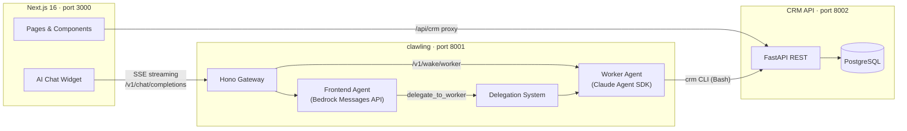

# Give(a)Lette

Hackathon project for Lette AI's PropTech challenge (2026-03-07). An agentic AI system that helps property managers process high-volume tenant, landlord, and contractor communications.

## Demo

- [Part 1: Running a shift](https://www.loom.com/share/9943acded24142d4a77b64440f464457) — AI batch-processes 100 emails, creates cases, drafts replies, assigns tasks
- [Part 2: UI and conversational AI overview](https://www.loom.com/share/a7f1ee550f384a27a8f95c30695b3431) — dashboard, inbox, task management, and AI chat assistant

## What It Does

- **Batch email triage** — AI processes unread email threads in shifts, classifying urgency, creating cases, drafting replies, and assigning tasks
- **Case management** — links related threads, builds context across messages, tracks resolution
- **Draft response generation** — composes professional replies referencing specific details, held for human review
- **Conversational AI assistant** — chat widget that navigates the UI, highlights elements, and answers questions from page context
- **Full CRM** — properties, contacts, cases, tasks, emails, threads, notes, shifts — all queryable and editable

## Architecture



### Two-tier AI via clawling

The AI layer is powered by [clawling](./clawling/), a lightweight TypeScript framework that orchestrates multiple Claude agents behind an OpenAI-compatible HTTP gateway.

- **Frontend Agent** (Bedrock Messages API, `messages-api` backend) — powers the chat widget. Responds in <5s by answering from page context or navigating the UI. Framework-defined tools (`page_action`, `delegate_to_worker`) execute within clawling, not the agent.
- **Worker Agent** (Claude Agent SDK, `claude-sdk` backend) — handles batch shift processing and complex CRM queries. Has full Bash access to the `crm` CLI. Delegates from the Frontend Agent only when needed (~30s response time).

The Frontend Agent has a comprehensive sitemap of all UI pages and prefers navigation over delegation — asking "show me tasks for Graylings" navigates to the property page instantly rather than spawning a worker query.

## Tech Stack

- **Docker Compose** — orchestrates the full stack (PostgreSQL, CRM API, clawling, Frontend)
- **[clawling](./clawling/)** — TypeScript agent orchestration framework (Hono + Zod + Claude SDKs)
- **CRM API** — FastAPI + PostgreSQL with full-text search, 8 entities, generic CRUD
- **CRM CLI** — `crm` command-line tool for agent ↔ CRM interaction (no MCP overhead)
- **Next.js 16** — frontend with dashboard, inbox, tasks, contacts, properties, search, shifts
- **Python + uv** — seed scripts, integration tests, utilities

## Frontend Pages

| Page | Description |
|------|-------------|
| **Dashboard** (`/`) | Priority-grouped open cases, collapsible cards with markdown descriptions, quick insights nav hub |
| **Inbox** (`/inbox`) | Outlook-style split pane, thread list with search/filters, draft editing with Save/Discard |
| **Tasks** (`/tasks`) | Task list with status dropdown (Not Started/In Progress/Completed), comments, search |
| **Cases** (`/cases/[id]`) | Full case detail: tasks with status controls, draft editor, email threads, notes, contacts |
| **Properties** (`/properties`) | Property cards linking to detail pages |
| **Property Detail** (`/properties/[id]`) | Open cases, email threads, contacts for a specific property |
| **Contacts** (`/contacts`) | Searchable directory with type filters (tenant, landlord, contractor, etc.) |
| **Contact Detail** (`/contacts/[id]`) | Linked cases, assigned tasks, recent emails |
| **Shifts** (`/shifts`) | Shift history, backlog count, trigger new shift |
| **Search** (`/search`) | Full-text email search |

## Getting Started

Prerequisites: Docker, [uv](https://docs.astral.sh/uv/)

```bash
# 1. Start the stack
docker compose up -d

# 2. Wait for CRM API to be ready (~10s)
#    Check with: docker compose logs -f crm-api

# 3. Seed test data (100 emails, contacts, 5 properties)
uv run scripts/seed.py

# 4. Open the frontend at http://localhost:3000
#    CRM API is at http://localhost:8002
```

### Running a shift

Trigger an AI shift from the Shifts page in the UI, or via CLI:

```bash
uv run scripts/agent.py --shift
```

The AI processes all unread email threads, creating cases, drafting replies, and assigning tasks. Progress is visible in real-time on the Shifts page.

### CLI tools

```bash
# Send a prompt to the agent
uv run scripts/agent.py "List all emails in the CRM"

# Check session status / restart
uv run scripts/agent.py --status
uv run scripts/agent.py --restart

# Reset + re-seed CRM data
uv run scripts/reseed.py

# Run tests (stack must be running)
./scripts/test.sh
```

## Domain Context

Built for **BTR/PRS property management** in Ireland (Build-to-Rent / Private Rented Sector). The test dataset covers 5 properties with communications spanning maintenance emergencies, RTB disputes, lease renewals, rent arrears, fire/safety compliance, and more.

## Project Structure

```
clawling/               # Agent orchestration framework (TypeScript)
  src/                  # Gateway, agent backends, delegation, sessions
  config.json           # Agent definitions, routing, delegation settings
  skills/frontend.md    # Frontend agent system prompt
  Dockerfile            # Node 20 + Claude Code CLI
crm/                    # CRM API service (FastAPI + PostgreSQL)
  main.py               # REST API with generic CRUD + full-text search
  models.py             # SQLAlchemy models (8 entities)
  database.py           # Async engine, sessions, lightweight migrations
crm-cli/                # CRM CLI tool (installed in clawling container)
  crm_cli/main.py       # Click-based CLI: crm <entity> <action>
agent/                  # Legacy agent (replaced by clawling)
  workspace/            # Agent skills (shift, triage) and CLAUDE.md
frontend/               # Next.js 16 frontend (port 3000)
  src/app/              # Pages: dashboard, inbox, tasks, cases, contacts, properties, shifts, search
  src/lib/crm.ts        # CRM data types, fetch functions, helpers
  src/lib/page-context.tsx  # Structured page context for AI chat
  src/components/       # SituationCard, DraftEditor, AIAssistant, QuickStats, UI primitives
scripts/                # Python scripts (run with uv)
tests/                  # Integration (CRM + agent API) + Playwright E2E tests
openspec/               # Spec-driven development (proposals, specs, tasks)
```
